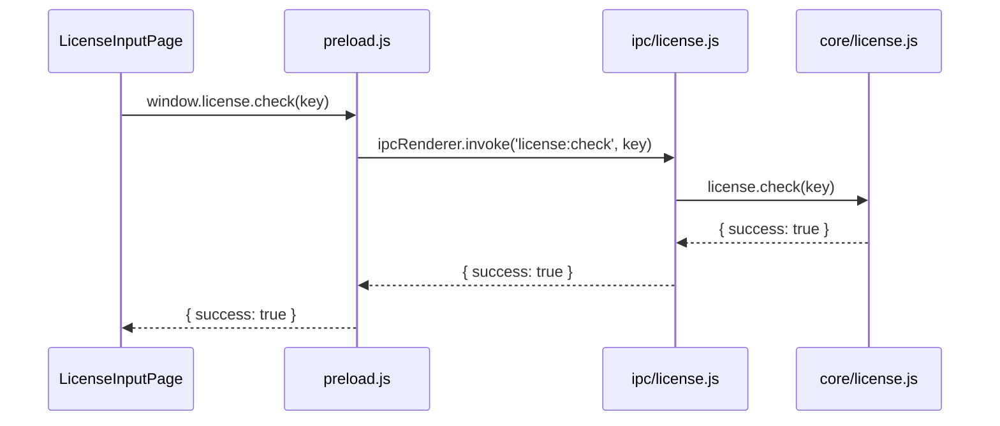

# WordPress 관리 애플리케이션

Electron과 React를 사용하여 개발된 WordPress 관리 애플리케이션입니다.

## 프로젝트 구조

```
src/
├── main/                      # 메인 프로세스
│   ├── config.json           # 애플리케이션 설정
│   ├── main.js               # 메인 프로세스 진입점
│   ├── preload.js            # 프리로드 스크립트
│   ├── serviceAccountKey.json # Firebase 서비스 계정 키
│   ├── tray.js               # 시스템 트레이 관련
│   ├── core/                 # 핵심 기능 모듈
│   │   ├── aws.js           # AWS 관련 기능
│   │   └── firebase/        # Firebase 관련 기능
│   └── ipc/                  # IPC 통신
│       └── firebase.js       # Firebase IPC 핸들러
└── renderer/                 # 렌더러 프로세스
    ├── App.jsx              # React 앱 진입점
    ├── index.html           # HTML 템플릿
    ├── index.css            # 전역 스타일
    ├── main.jsx             # 렌더러 진입점
    ├── routes.jsx           # 라우팅 설정
    ├── components/          # 재사용 가능한 컴포넌트
    │   ├── common/          # 공통 컴포넌트
    │   │   └── Sidebar.jsx  # 사이드바 컴포넌트
    │   └── layout/          # 레이아웃 컴포넌트
    │       └── MainLayout.jsx # 메인 레이아웃
    └── pages/               # 페이지 컴포넌트
        ├── DashboardPage.jsx # 대시보드 페이지
        ├── HelpPage.jsx     # 도움말 페이지
        ├── LicenseInputPage.jsx # 라이센스 입력 페이지
        └── SettingsPage.jsx # 설정 페이지
```

## 데이터 흐름



## 환경 설정

### 설정 파일

1. `src/main/config.json`

   - 애플리케이션의 기본 설정
   - Firebase 프로젝트 ID, API 키 등
   - 라이센스 검증 관련 설정

2. `src/main/serviceAccountKey.json`
   - Firebase Admin SDK 인증 정보
   - 서비스 계정 키 파일

## 스크립트 설명

### 개발 관련

- `yarn dev`

  - 개발 모드 실행
  - Vite 개발 서버와 Electron을 동시에 실행
  - `concurrently`로 병렬 실행
  - `wait-on`으로 Vite 서버 준비 대기

- `yarn renderer-dev`

  - Vite 개발 서버 실행
  - React 애플리케이션 개발 서버
  - HMR(Hot Module Replacement) 지원

- `yarn electron-dev`
  - Electron 개발 모드 실행
  - `mode=dev` 환경 변수 설정
  - 개발용 메인 프로세스 실행

### 빌드 관련

- `yarn build`

  - 전체 애플리케이션 빌드
  - 렌더러 프로세스와 메인 프로세스 빌드 후 패키징

- `yarn renderer-build`

  - Vite를 사용한 렌더러 프로세스 빌드
  - React 애플리케이션 번들링
  - 프로덕션 최적화

- `yarn electron-build`
  - Electron 빌드 스크립트 실행
  - `build.js`를 통한 빌드 설정 적용

### 실행 관련

- `yarn start`
  - 프로덕션 모드 실행
  - `mode=prod` 환경 변수 설정
  - 빌드된 애플리케이션 실행
